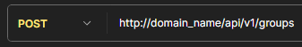
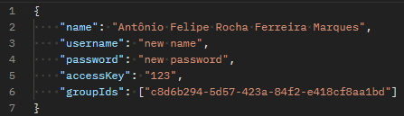

# Available methods in the API:
**OBS: As this microservice is not in production, the domain of the URLS that are being shown below is as "domain_name", if this project is for production level, I will change these images to put the URLS with the production domain .**

## 1 - APPLICATION entity methods:

### 1.1 - Create (POST) Application:

#### 1.1.1 - Request URL:

#### 1.1.2 - Request body: The body request is of JSON type, below there is an example it.  

#### 1.1.3 - Response: The response has 201 status and its body contains the application created:  

#### Warnings:
- If the user sent invalid values, he will receive a response with 400 status which contains a body that informs the error. Example:

### 1.2 - READ (GET) All Applications:

#### 1.2.1 - Request URL:  

#### 1.2.2: - Request body: This request does not require a body.  

#### 1.1.3 - Response: If all goes well, you will receive a response with 200 status. And a body like this:  

### 1.3 - READ (GET) One Application:

#### 1.3.1 - Request URL:  

#### 1.3.2: - Request body: This request does not require a body.  

#### 1.3.3 - Response: If all goes well, you will receive a response with 200 status. And a body like this:  

#### Warnings:
- If the ID is not associated with any Application. You will receive the following response with 400 status:  

### 1.4 - UPDATE (PUT) Application:

#### 1.4.1 - Request URL:  

#### 1.4.2 - Request body: The body request is of JSON type, below there is an example it.  

#### 1.4.3 - Response: If all goes well, you will receive a response like this:  

#### Warnings:
- If the user sent invalid values, he will receive a response with 400 status which contains a body that informs the error. Example:  

- If the ID is not associated with any application. You will receive the following response with 400 status:  
  

### 1.5 - DELETE (DEL) Application:

#### 1.5.1 - Request URL:  

#### 1.5.2: - Request body: This request does not require a body, you will need only pass the application ID at URI.  

#### 1.5.3 - Response: If all goes well, you will receive a response with 204 status.

#### Warnings:
- If the ID is not associated with any application. You will receive the following response with 400 status:  
  

## 2 - PERMISSION entity methods:

### 2.1 - Create (POST) Permission:

#### 2.1.1 - Request URL:

#### 2.1.2 - Request body: The body request is of JSON type, below there is an example it.  

#### 2.1.3 - Response: The response has 201 status and its body contains the permission created:  

#### Warnings:
- The microservice will always convert the 'name' field (sent in the request) to a valid format. Example:  
 >>> 

### 2.2 - READ (GET) All Permissions:

#### 2.2.1 - Request URL:  

#### 2.2.2: - Request body: This request does not require a body.  

#### 2.1.3 - Response: If all goes well, you will receive a response with 200 status. And a body like this:  

### 2.3 - READ (GET) One Permission:

#### 2.3.1 - Request URL:  

#### 2.3.2: - Request body: This request does not require a body.  

#### 2.3.3 - Response: If all goes well, you will receive a response with 200 status. And a body like this:  

#### Warnings:
- If the ID is not associated with any Permission. You will receive the following response with 400 status:  

### 2.4 - UPDATE (PUT) Permission:

#### 2.4.1 - Request URL:  

#### 2.4.2 - Request body: The body request is of JSON type, below there is an example it.  

#### 2.4.3 - Response: If all goes well, you will receive a response like this:  

#### Warnings:
- The microservice will always convert the 'name' field (sent in the request) to a valid format. Example:  
   >>> 

- If the ID is not associated with any Permission. You will receive the following response with 400 status:  
  

### 2.5 - DELETE (DEL) Permission:

#### 2.5.1 - Request URL:  

#### 2.5.2: - Request body: This request does not require a body, you will need only pass the permission ID at URI.  

#### 2.5.3 - Response: If all goes well, you will receive a response with 204 status.

#### Warnings:
- If the ID is not associated with any Permission. You will receive the following response with 400 status:  
  

  
## 3 - GROUP entity methods:

### 3.1 - Create (POST) Group:

#### 3.1.1 - Request URL:

#### 3.1.2 - Request body: The body request is of JSON type, below there is an example it.  

#### 3.1.3 - Response: The response has 201 status and its body contains the group created:  

#### Warnings:
- If the user sent invalid values, he will receive a response with 400 status which contains a body that informs the error. Example:  

- If the user sent a group name which already exists at the same application, he will receive a response with 400 status which contains a body that informs the error. Example:  

### 3.2 - READ (GET) All Group:

#### 3.2.1 - Request URL:  

#### 3.2.2: - Request body: This request does not require a body.  

#### 3.1.3 - Response: If all goes well, you will receive a response with 200 status. And a body like this:  

### 3.3 - READ (GET) One Group:

#### 3.3.1 - Request URL:  

#### 3.3.2: - Request body: This request does not require a body.  

#### 3.3.3 - Response: If all goes well, you will receive a response with 200 status. And a body like this:  

#### Warnings:
- If the ID is not associated with any Group. You will receive the following response with 400 status:  

### 3.4 - UPDATE (PUT) Group:

#### 3.4.1 - Request URL:  

#### 3.4.2 - Request body: The body request is of JSON type, below there is an example it.  

#### 3.4.3 - Response: If all goes well, you will receive a response like this:  

#### Warnings:
- If the user sent invalid values, he will receive a response with 400 status which contains a body that informs the error. Example:  
  
- If the user sent a group name which already exists at the same application, he will receive a response with 400 status which contains a body that informs the error. Example:  
  
- If the ID is not associated with any Group. You will receive the following response with 400 status:  
  

### 3.5 - DELETE (DEL) Group:

#### 3.5.1 - Request URL:  

#### 3.5.2: - Request body: This request does not require a body, you will need only pass the group ID at URI.  

#### 3.5.3 - Response: If all goes well, you will receive a response with 204 status.

#### Warnings:
- If the ID is not associated with any Group. You will receive the following response with 400 status:  
  

  
## 4 - USER entity methods:

### 4.1 - Create (POST) User:

#### 4.1.1 - Request URL:

#### 4.1.2 - Request body: The body request is of JSON type, below there is an example it.  

#### 4.1.3 - Response: The response has 201 status and its body contains the user created:  

#### Warnings:
- If the user sent invalid values, he will receive a response with 400 status which contains a body that informs the error. Examples:  

- If the user submits one ID of a group that doesn't belong to the corresponding application of the access key sent, he will receive a response with 400 status which contains a body that informs the error. Example:  

### 4.2 - READ (GET) All User:

#### 4.2.1 - Request URL:  

#### 4.2.2: - Request body: This request does not require a body.  

#### 4.1.3 - Response: If all goes well, you will receive a response with 200 status. And a body like this:  

### 4.3 - READ (GET) One User:

#### 4.3.1 - Request URL:  

#### 4.3.2: - Request body: This request does not require a body.  

#### 4.3.3 - Response: If all goes well, you will receive a response with 200 status. And a body like this:  

#### Warnings:
- If the ID is not associated with any User. You will receive the following response with 400 status:  

### 4.4 - UPDATE (PUT) User:

#### 4.4.1 - Request URL:  

#### 4.4.2 - Request body: The body request is of JSON type, below there is an example it.  

#### 4.4.3 - Response: If all goes well, you will receive a response like this:  

#### Warnings:
- If the user sent invalid values, he will receive a response with 400 status which contains a body that informs the error. Examples:  
  
  
- If the user submits one ID of a group that doesn't belong to the corresponding application of the access key sent, he will receive a response with 400 status which contains a body that informs the error. Example:  
  
- If the ID is not associated with any User. You will receive the following response with 400 status:  
  

### 4.5 - DELETE (DEL) User:

#### 4.5.1 - Request URL:  

#### 4.5.2: - Request body: This request does not require a body, you will need only pass the user ID at URI.  

#### 4.5.3 - Response: If all goes well, you will receive a response with 204 status.

#### Warnings:
- If the ID is not associated with any User. You will receive the following response with 400 status:  
  
- If the ID is not associated with any User. You will receive the following response with 400 status:  
  

### 4.5 - LOGIN User:

#### 4.5.1 - Request URL:  

#### 4.5.2 - Request body: The body request is of JSON type, below there is an example it.  

#### 4.5.3 - Response: If all goes well, you will receive a response which contains the permissions of user and one JWT token that has the user's credentials. Example:  

#### Warnings:
- If the user sent invalid values, he will receive a response with 400 status which contains a body that informs the error. Examples:  

### 4.6 - VERIFY PERMISSION of User:

#### 4.6.1 - Request URL:  

#### 4.6.2: - Request body: This request does not require a body, but you will need to pass the user's JWT token in order to microservice perform authentication of user and verify if the user has the permission sent.  

#### 4.6.3 - Response: If all goes well and the user has the permission related, he will receive a response with 204 status. But if he does not have permission, he will receive a response with 401 (UNAUTHORIZED) status.

#### Warnings:
- If the user sent an invalid JWT token, he will receive a response with 400 status which contains a body that informs the error. Example:  
